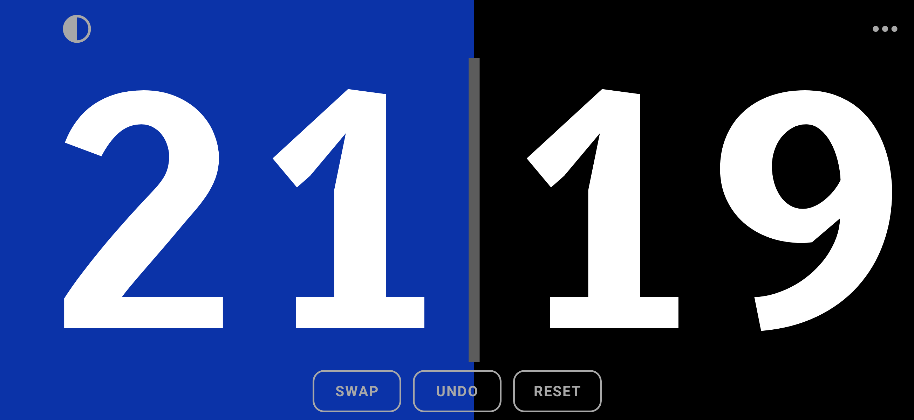
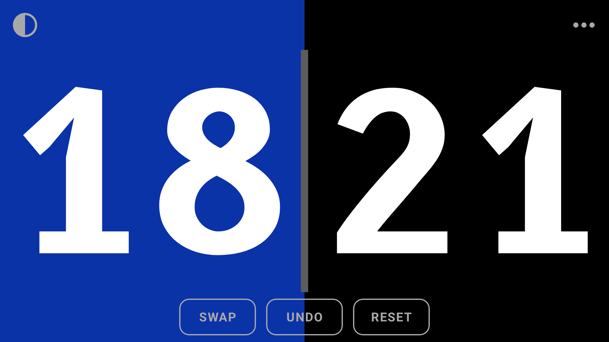
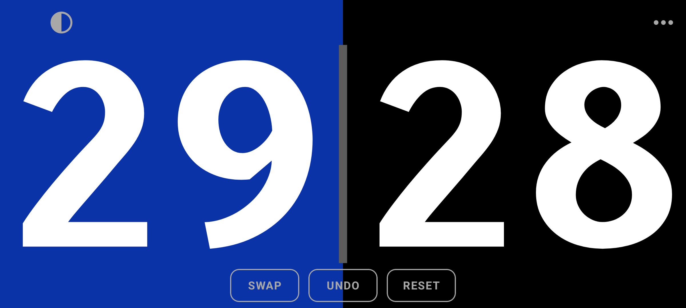
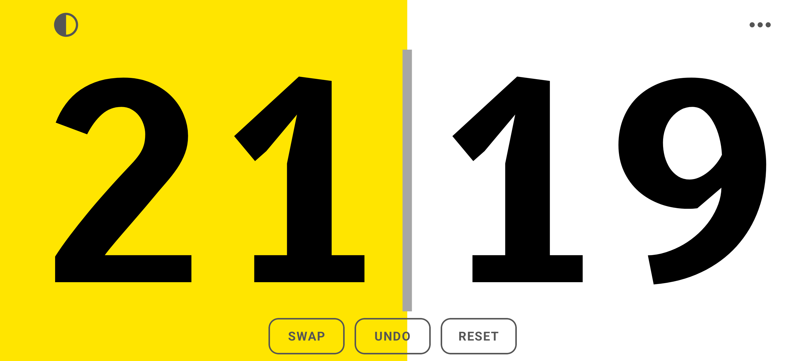
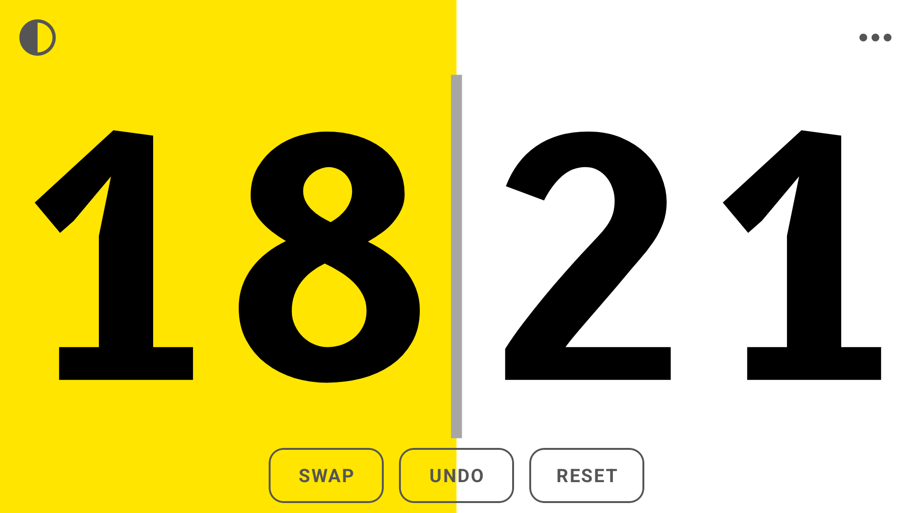
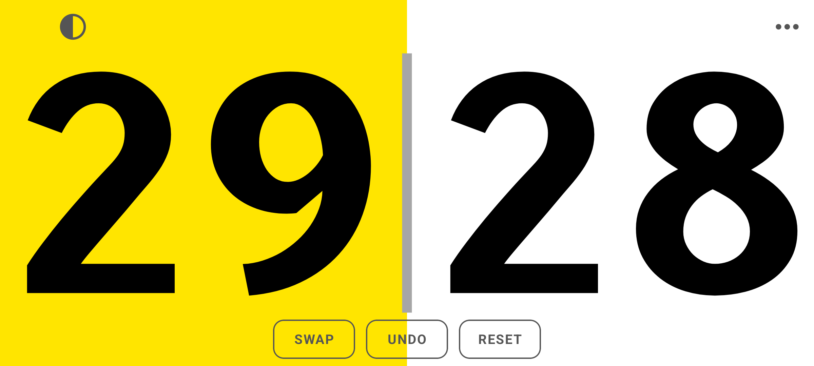

# Media Control Scoreboard

A fullscreen landscape badminton scoreboard for an Android phone placed beside the court.
Two huge scores are readable from about 6 m away, and the score can be kept with a
**COROS APEX 4** through the watch's built-in Media Control ("手机音频"). The app shows up
as the phone's active media player, and the watch displays the score as the track title.

| 2608×1200 (target phone, emulated notch on the left) | 1920×1080 (16:9) | 2400×1080 (20:9, emulated punch hole) |
|---|---|---|
|  |  |  |
|  |  |  |

The half that won the last point is tinted (blue on dark, yellow on light). In badminton the
rally winner serves next, so the tint shows who is serving.

## Build and install

You need JDK 17 or newer and an Android SDK with platform 37 (set `sdk.dir` in
`local.properties` or `ANDROID_HOME`). The first build also needs network access: the Gradle
wrapper downloads Gradle 9.7.1, Maven downloads the dependencies, and the foojay plugin
provisions a JDK 17 toolchain if none is installed.

```sh
./gradlew assembleRelease   # app/build/outputs/apk/release/app-release.apk (R8-optimised, ~1 MB)
./gradlew assembleDebug     # app/build/outputs/apk/debug/app-debug.apk
adb install -r app/build/outputs/apk/release/app-release.apk
```

The release build is signed with the local debug key, so it installs without keystore setup.
That is fine for personal sideloading; use your own key before you distribute it. Prefer the
release build for matches: it starts faster and responds faster than the debug build.
To install over Wi-Fi, enable *Wireless debugging* on the phone, then run
`adb pair <ip:port>` and `adb connect <ip:port>`.

Tests:

```sh
./gradlew testDebugUnitTest          # JVM: score/history, undo, reset guard, media mapping, layout
./gradlew connectedDebugAndroidTest  # device/emulator: drives the real MediaSession via MediaController
```

## Using the scoreboard

- **Tap the left or right half** to add a point to that side. Only a clean one-finger tap counts.
  Swipes (for example to reveal the system bars), holds longer than 0.8 s, multi-finger
  contact and touches on any control or message never count.
- **UNDO** (bottom centre) reverses the last point. Repeat it to step back through the whole match.
- **RESET**: hold it for about 1 s (the button fills up) to return to 0 : 0 and clear the history.
  A short tap only shows a hint.
- **SWAP**: use it when the teams change ends. The scores, the serve tint and the undo history
  follow the teams.
- **◐** (top-left) switches the light/dark background; the choice is remembered.
  **⋯** (top-right) opens the menu: settings, the watch mapping, recent remote commands, and Exit.
- **Back twice** leaves the scoreboard. One stray back gesture only shows a hint.
- Every change briefly flashes the half that changed. Remote changes also show a short
  "Remote: …" line above the digits.
- By default the screen stays on, runs at full brightness, and the scoreboard shows over the
  lock screen. Each of these is a switch in the menu.

The score and its undo history are saved on every change. They survive rotation, activity
recreation and process restarts. Scores stop at 99.

## COROS APEX 4 setup

1. Pair the watch in the COROS app as usual. In Android settings, give the **COROS app**
   notification access (Settings → Apps → Special app access → Notification access). COROS
   needs this for Media Control. Keep the COROS app running in the background.
   On Xiaomi/HyperOS, set the COROS app to *Battery saver: No restrictions* and allow
   *Autostart*.
2. On HyperOS, also set **Scoreboard** to *Battery saver: No restrictions*, so its media service
   survives long matches with the screen off. If you want *Show over the lock screen*, also allow
   *Show on Lock screen* in the app's *Other permissions*.
3. Open Scoreboard. A "Scoreboard" media notification appears and the session reports
   "playing". On the watch, open Media Control: Toolbox (long-press Back) → Media Control, or
   use the *Switch View* shortcut during an activity. It shows **0 : 0** as the title.
4. Don't play music on the same phone during the match. The watch controls the active media
   session, so another player could take over. Bringing Scoreboard to the front re-claims it.

### Watch control mapping

| COROS Media Control | Scoreboard |
|---|---|
| ⏮ Previous | **Left +1** |
| ⏭ Next | **Right +1** |
| ⏯ Play / Pause | **Undo** the last point (repeatable) |
| Volume window: any volume step, slider move or mute, **twice** (pause ≥ 0.65 s in between, second within 5 s) | **Reset to 0 : 0** |

- The title on the watch is always the score, e.g. `11 : 9`. The artist/subtitle line shows the
  last action (`Right +1`, `Undo`, `Volume again = RESET`, `Reset to 0 : 0`, …). Both update
  immediately after every change and when the app starts.
- The first volume input only *arms* the reset. The phone then shows a red
  "RESET? Press volume again (5)" banner and the watch subtitle reads `Volume again = RESET`.
  Any other command cancels the armed reset. One continuous slider drag, or a held key, counts
  as one press, so it can never confirm a reset by itself.
- Watches in "podcast mode" send skip back/forward instead of previous/next. Rewind, fast-forward
  and seeks map to left/right +1 the same way.
- The phone's own volume keys work as reset presses too (same two-step rule). So do
  headset/Bluetooth media keys and `adb shell cmd media_session dispatch next|previous|play-pause`.

## How it works

- `core/` is pure Kotlin and covered by unit tests:
  - `ScoreState` stores the undo history per team (`A`/`B`). The displayed score is replayed
    from that history, so the history can never disagree with the score.
  - `ResetGuard` implements the two-step volume reset. `MediaCommandMapping` maps keys,
    transport controls and seeks to commands.
  - `ScoreLayout` does the digit-fitting geometry.
- `ScoreboardController` owns the score. Touch, MediaSession callbacks and volume all run
  through it on the main thread, and it saves the history (SharedPreferences) on every change.
- `media/ScoreboardService` is a `mediaPlayback` foreground service with a framework
  `android.media.session.MediaSession`:
  - The session always reports `STATE_PLAYING` and advertises only previous/next/play/pause.
    This keeps it at the top of `MediaSessionManager.getActiveSessions()`, which is what watch
    companion apps typically read. It also keeps the session "user-engaged", so newer Android
    versions don't demote the foreground service of an idle media session.
  - Media button events are handled directly, without the framework's 300 ms play/pause
    double-tap delay, which would also turn two quick undos into "next".
  - Volume uses `setPlaybackToRemote` with an absolute `VolumeProvider` (0–10, springs back to 5).
    Volume sent to the session is captured and never changes the phone's real volume.
  - A MediaStyle notification carries the session token. This also covers controllers that find
    sessions through notifications. Media-session notifications don't need the notification
    permission.
  - When the scoreboard opens, it plays 0.3 s of digital silence. Android sends media keys to
    the app that last played audio, so this routes them here. The clip requests no audio focus.
- The framework `MediaSession` is used instead of Media3 because there is no player here. The
  app needs raw control over media-button handling, remote volume and the playback state.
- `ui/` is Jetpack Compose:
  - The digits are drawn as vector outlines taken from the bundled font and fitted by their exact
    ink bounds. A two-digit score fills its half, and both sides always share one size, so
    nothing jumps when a score reaches 10.
  - The layout comes from the actual window size, so it works on 16:9 to 21:9 phones at any
    density. Display-cutout rectangles that reach the digit rows push that side's margin
    inward; rounded corners push the corner buttons inward.
  - The window is edge to edge and immersive: the system bars are hidden, and a swipe shows them
    temporarily.

### Why this font

The digits use **B612 Bold**, subset to 0–9. B612 is the Airbus/ENAC cockpit-display typeface,
licensed under SIL OFL 1.1 (see `app/src/main/assets/licenses/`). It was picked by measurement
from 55 variants of 34 open fonts:

1. Render each font at the size it can actually reach on the 2608×1200 screen.
2. Blur it to simulate viewing from 6 m with 2–3 arcmin acuity loss.
3. Compare every pair of digits.

B612 had the most even worst case. Its 3 has a flat top, unlike the round 8. Its 6 and 9 have
open, straight tails, unlike 0 and 8. Its 1 has a foot and a flag, unlike 7. Its 0 is plain,
with no slash or dot. Its figures are tabular (equal width), and its strokes are about 21 % of
the figure height. On the target phone the digits are about 700 px (≈ 41 mm) tall.

## Permissions

Only `FOREGROUND_SERVICE` and `FOREGROUND_SERVICE_MEDIA_PLAYBACK`. The app has no network access,
no accounts, no analytics, no ads, and no runtime permission prompts.

## Known limitations

- **Not tested with a real watch.** Everything above was verified on an Android emulator
  (API 37, app targeting API 36 like the Android 16 / HyperOS target phone). That includes
  MediaController transport controls, media keys, session volume, the phone-volume fallback,
  screen-off operation, and process restarts. The COROS app's code is packed by a protector, so
  how it talks to sessions could not be inspected. Its manifest shows that it uses a
  notification listener, which suggests `getActiveSessions()` + `MediaController`. Open
  **⋯ → Recent remote commands** to see exactly what your watch sends, for example
  `skipToNext → Right +1 · com.yf.smart.coros.dist`.
- **Watch volume is the least certain part.**
  - If the COROS app sends volume to the session (`MediaController.setVolumeTo/adjustVolume`),
    the scoreboard captures it and the phone's volume never changes.
  - If it changes the phone's media volume directly, the fallback *Also use phone media-volume
    changes* (on by default) notices the change and counts it as a press. It then restores the
    previous volume right away, so the phone volume is never left modified. The fallback relies
    on Android's non-public volume-change broadcasts.
  - A step in a direction where the volume is already at its limit (0 or max) changes nothing
    and cannot be detected; use the other direction.
  - While the fallback is on, the phone's media volume can't be changed; turn the fallback off
    in the menu if you need to. Turning off *Watch volume resets the score* returns volume to
    normal behaviour.
  - Android drops mute commands for remote sessions. A watch mute only counts if the COROS app
    sends it as volume 0 or as a phone-volume mute.
  - If volume doesn't reach the app on your phone, reset is still available on the phone
    (hold RESET, or press a phone volume key twice). You can also press Undo on the watch
    repeatedly.
- **Session selection**: if several media sessions exist, which one the watch controls is up to
  the COROS app. Keep other players stopped. The scoreboard re-claims the top spot whenever it
  comes to the front.
- **Accidental remote input**: a Bluetooth headset that sends "play" when it connects would
  trigger an undo.
- **Reset is not undoable**: by requirement, reset clears the history, so both the on-screen and
  the remote reset need a deliberate second action.
- **HyperOS**: aggressive battery management can kill background services. *Show over the lock
  screen* needs the extra *Show on Lock screen* permission. Starting with Android 16, Android
  ignores the fixed landscape orientation on large screens (tablets); phones are unaffected.
- **Future Android versions**: Android 17 restricts volume changes from apps without a visible
  activity or foreground service. This doesn't affect the Android 16 target phone, but it could
  stop COROS's own volume calls on newer phones.
